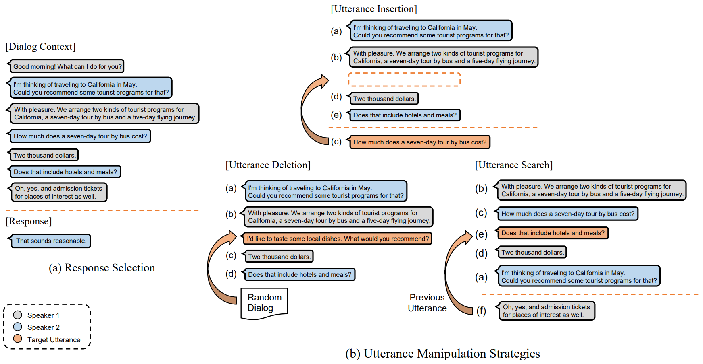

UMS for Multi-turn Response Selection
====================================

Implements the model described in the following paper [Do Response Selection Models Really Know What's Next? Utterance Manipulation Strategies for Multi-turn Response Selection](https://arxiv.org/abs/2009.04703).

```
@article{whang2020ums,
  title={Do Response Selection Models Really Know What's Next? Utterance Manipulation Strategies for Multi-turn Response Selection},
  author={Whang, Taesun and Lee, Dongyub and Oh, Dongsuk and Lee, Chanhee and Han, Kijong and Lee, Dong-hun and Lee, Saebyeok},
  journal={arXiv preprint arXiv:2009.04703},
  year={2020}
}
```

This code is reimplemented as a fork of [huggingface/transformers][1] and [taesunwhang/BERT-ResSel][1].



Setup and Dependencies
----------------------

This code is implemented using PyTorch v1.6.0, and provides out of the box support with CUDA 10.1 and CuDNN 7.6.5.

Anaconda / Miniconda is the recommended to set up this codebase.

### Anaconda or Miniconda

Clone this repository and create an environment:

```shell
git clone https://www.github.com/taesunwhang/UMS-ResSel
conda create -n ums_ressel python=3.7

# activate the environment and install all dependencies
conda activate ums_ressel
cd UMS-ResSel
pip install -r requirements.txt
```


Preparing Data and Checkpoints
-------------

### Pre- and Post-trained Checkpoints

We provide following pre- and post-trained checkpoints. 

- [bert-base (english)][1], [bert-base-wwm (chinese)][6]
- bert-post (ubuntu, douban, e-commerce)
- [electra-base (english)][1], [electra-base (chinese)][7]
- electra-post (ubuntu, douban, e-commerce)

```shell
sh scripts/download_pretrained_checkpoints.sh
```

### Data pkls for Fine-tuning (Response Selection)

Original version for each dataset is availble in [Ubuntu Corpus V1][3], [Douban Corpus][4], and [E-Commerce Corpus][5], respectively.

``` shell
sh scripts/download_datasets.sh
```


Domain-specific Post-Training
--------

### Post-tarining Creation

#### Data for post-training BERT

```shell
#Ubuntu Corpus V1
sh scripts/create_bert_post_checkpoints_ubuntu.sh
#Douban Corpus
sh scripts/create_bert_post_checkpoints_douban.sh
#E-commerce Corpus
sh scripts/create_bert_post_checkpoints_e-commerce.sh
```

#### Data for post-training ELECTRA 

```shell
sh scripts/download_electra_post_training_pkl.sh
```


### BERT+ (e.g., Ubuntu Corpus V1)

```shell
python3 main.py --model bert_post_training --task_name ubuntu --data_dir data/ubuntu_corpus_v1 --bert_pretrained bert-base-uncased --bert_checkpoint_path bert-base-uncased-pytorch_model.bin --task_type response_selection --gpu_ids "0" --root_dir /path/to/root_dir --training_type post_training
```

### ELECTRA+ (e.g., Douban Corpus)

```shell
python3 main.py --model electra_post_training --task_name douban --data_dir data/electra_post_training --bert_pretrained electra-base-chinese --bert_checkpoint_path electra-base-chinese-pytorch_model.bin --task_type response_selection --gpu_ids "0" --root_dir /path/to/root_dir --training_type post_training
```


Training Response Selection Models
--------

### Model Arguments

#### BERT-Base

| model     | task_name              | data_dir                         | bert_pretrained       | bert_checkpoint_path                |
| --------- | ---------------------- | -------------------------------- | --------------------- | ----------------------------------- |
| bert_base | ubuntu                 | data/ubuntu_corpus_v1            | bert-base-uncased     | bert-base-uncased-pytorch_model.bin |
| bert_base | douban<br />e-commerce | data/douban<br />data/e-commerce | bert-base-wwm-chinese | bert-base-wwm-chinese_model.bin     |

#### BERT-Post

| model     | task_name  | data_dir              | bert_pretrained     | bert_checkpoint_path                  |
| --------- | ---------- | --------------------- | ------------------- | ------------------------------------- |
| bert_post | ubuntu     | data/ubuntu_corpus_v1 | bert-post-uncased   | bert-post-uncased-pytorch_model.pth   |
| bert_post | douban     | data/douban           | bert-post-douban    | bert-post-douban-pytorch_model.pth    |
| bert_post | e-commerce | data/e-commerce       | bert-post-ecommerce | bert-post-ecommerce-pytorch_model.pth |

#### ELECTRA-Base

| model        | task_name              | data_dir                         | bert_pretrained      | bert_checkpoint_path                   |
| ------------ | ---------------------- | -------------------------------- | -------------------- | -------------------------------------- |
| electra_base | ubuntu                 | data/ubuntu_corpus_v1            | electra-base         | electra-base-pytorch_model.bin         |
| electra_base | douban<br />e-commerce | data/douban<br />data/e-commerce | electra-base-chinese | electra-base-chinese-pytorch_model.bin |

#### ELECTRA-Post

| model        | task_name  | data_dir              | bert_pretrained        | bert_checkpoint_path                     |
| ------------ | ---------- | --------------------- | ---------------------- | ---------------------------------------- |
| electra_post | ubuntu     | data/ubuntu_corpus_v1 | electra-post           | electra-post-pytorch_model.pth           |
| electra_post | douban     | data/douban           | electra-post-douban    | electra-post-douban-pytorch_model.pth    |
| electra_post | e-commerce | data/e-commerce       | electra-post-ecommerce | electra-post-ecommerce-pytorch_model.pth |


### BERT+ (e.g., Ubuntu Corpus V1)

```shell
python3 main.py --model bert_post --task_name ubuntu --data_dir data/ubuntu_corpus_v1 --bert_pretrained bert-post-uncased --bert_checkpoint_path bert-post-uncased-pytorch_model.pth --task_type response_selection --gpu_ids "0" --root_dir /path/to/root_dir
```

### UMS BERT+ (e.g., Douban Corpus)

```shell
python3 main.py --model bert_post --task_name douban --data_dir data/douban --bert_pretrained bert-post-uncased --bert_checkpoint_path bert-post-uncased-pytorch_model.pth --task_type response_selection --gpu_ids "0" --root_dir /path/to/root_dir --multi_task_type "ins,del,srch"
```

### UMS ELECTRA (e.g., E-Commerce)

```shell
python3 main.py --model electra_base --task_name e-commerce --data_dir data/e-commerce --bert_pretrained electra-base-chinese --bert_checkpoint_path electra-base-chinese-pytorch_model.bin --task_type response_selection --gpu_ids "0" --root_dir /path/to/root_dir --multi_task_type "ins,del,srch"
```


Evaluation
----------
### UMS BERT+ (e.g., Ubuntu Corpus V1)

```shell
python3 main.py --model bert_post --task_name ubuntu --data_dir data/ubuntu_corpus_v1 --bert_pretrained bert-post-uncased --bert_checkpoint_path bert-post-uncased-pytorch_model.pth --task_type response_selection --gpu_ids "0" --root_dir /path/to/root_dir --evaluate /path/to/checkpoints --multi_task_type "ins,del,srch"
```


[1]: https://github.com/huggingface/transformers
[2]: https://github.com/taesunwhang/BERT-ResSel
[3]: https://www.dropbox.com/s/2fdn26rj6h9bpvl/ubuntu_data.zip
[4]: https://github.com/MarkWuNLP/MultiTurnResponseSelection
[5]: https://github.com/cooelf/DeepUtteranceAggregation
[6]: https://github.com/ymcui/Chinese-BERT-wwm
[7]: https://github.com/ymcui/Chinese-ELECTRA